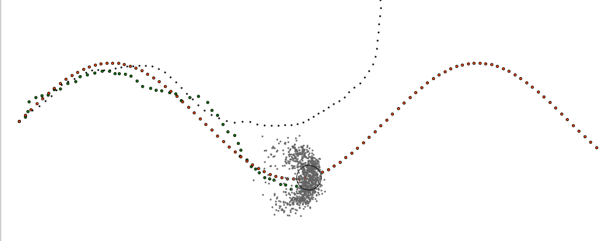

# 2D Particle Filter Scala implementation




Implements a PF that uses 
  * Monty Hall Particle Filter machinery for robust, convenient, and flexible likelihood computation (https://github.com/scilari/mhpf)
  * Ancestry tree as compact storage for particle histories, such as maps (https://github.com/scilari/ancestry)
  * QuadTree spatial search library for some geometric primitives and use-case convenience (https://github.com/scilari/spatialsearch_dotty) 


## Building and running tests
Uses the `mill` build tool (https://mill-build.com/mill/Intro_to_Mill.html). Run the tests with:
```
./mill particlefilter.test
```
For visual output, use `VISUALIZE` flag in CloudTests.
## Setting up and updating submodules:
```
git submodule update --init --recursive
git submodule foreach git pull origin main 
```

